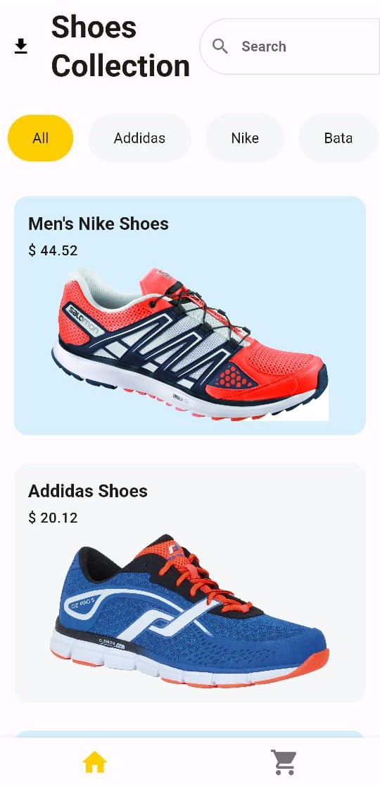
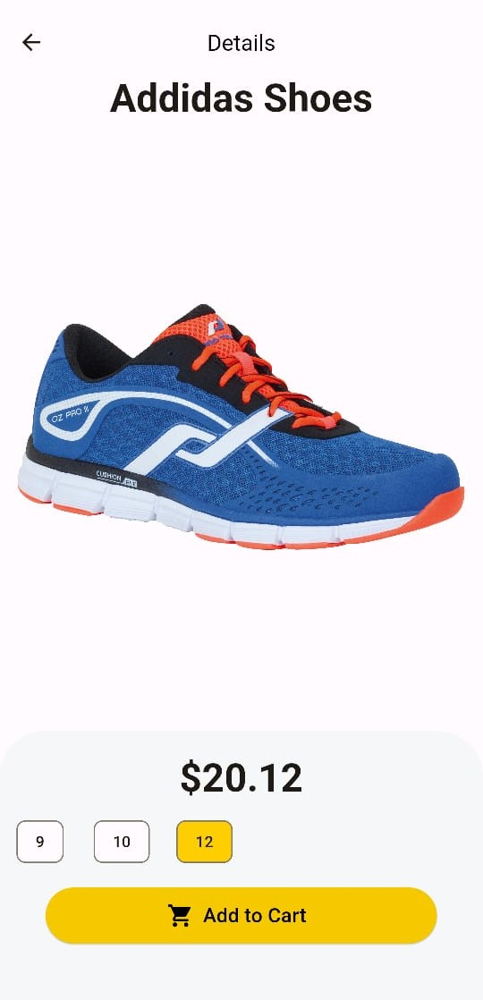
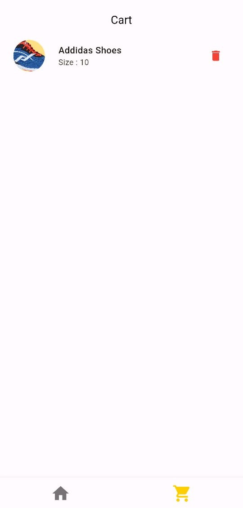

# Sneakers Shop App

Welcome to the Sneakers Shopping App repository! This Flutter-based mobile application was developed as a part of the learning process to delve into mobile app development using Flutter framework. This app enables users to browse a collection of sneakers, view details, add them to the cart, and make purchases.

## Features
- Browse through a curated collection of sneakers.
- View detailed information about each sneaker, including name, price, and available sizes.
- Add sneakers to the cart.
- Remove sneakers from the cart based on the selected size.

## Installation
To install and run the app on your local machine, follow these steps:

1. Clone the repository to your local machine using the following command:
   ```
   git clone https://github.com/ansh172003/shoesapp.git
   ```

2. Navigate to the project directory:
   ```
   cd shop_app
   ```

3. Ensure you have Flutter installed on your machine. If not, follow the instructions on the [official Flutter website](https://flutter.dev/docs/get-started/install).

4. Run the app on an emulator or a connected device using the following command:
   ```
   flutter run
   ```

## Demo
To see a live demo of the app, you can visit the hosted website: [Sneakers Shopping App](https://sneaker-app-863ff.web.app/).

## Download APK
You can download the APK file of the app from the following link: [Sneakers Shopping App APK](https://drive.google.com/file/d/1XhQELWcO4n5YzlfRCT6CVnzN0Nc6ppbQ/view?usp=sharing).

## Repository
Link to the GitHub repository: [Sneakers Shopping App Repository](https://github.com/ansh172003/shoesapp)

## Screenshots
Include screenshots here to showcase the app's interface and features.




## Contributing
Contributions are welcome! If you have any suggestions, enhancements, or bug fixes, feel free to open an issue or create a pull request.


## Acknowledgements
- Thank you to the Flutter community for providing resources and support.
- Special thanks to [Rivaan](https://www.youtube.com/@RivaanRanawat) for inspiration and guidance during the development process.

---
Feel free to modify this README according to your specific needs and preferences. Happy coding! 🚀